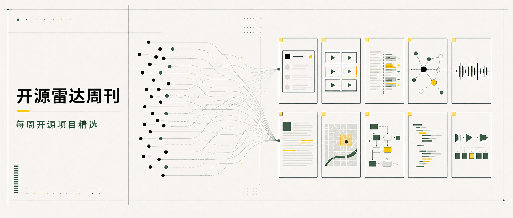

# 开源雷达周刊

这周一共看了 30 个项目，最后留下 10 个。

它们不全是刚冒出来的新仓库，也不都和 Agent 有关：有已经维护多年的客服和标注平台，也有视频管线、语音工具、GIS 工作区和还很早期的 TypeScript 编译器。下面按用途分成三组，方便快速找到值得自己动手试的项目。

## 一、可以直接进入评估清单

### 1. Chatwoot：把客服渠道放回自己的系统

[Chatwoot](https://github.com/chatwoot/chatwoot) 不算新项目，但它是本周最接近“可以直接评估”的一个。在线聊天、邮件、WhatsApp、共享收件箱、自动化和报表都在同一套自托管系统里，测试、Docker、API 文档和安全政策也比较齐全。

真要试，不妨先接一条低风险渠道。它真正的成本不在安装，而在数据库、Redis、邮件、备份和后续升级；社区版与企业目录的许可证边界也要提前看清楚。

### 2. CVAT：视觉数据生产的成熟工具

[CVAT](https://github.com/cvat-ai/cvat) 覆盖图像、视频和 3D 标注，也提供质量控制、团队协作、SDK、自动标注和自托管部署。对于计算机视觉团队，它比轻量标注 Demo 更接近一套完整的数据生产系统。

建议先拿一个小型真实数据集跑通导入、标注、质检和导出。大型视频、3D 数据与多人任务会迅速放大存储、队列和权限管理的成本。

### 3. Harness：把开发流程收进一个平台

[Harness](https://github.com/harness/harness) 把代码托管、CI/CD、Gitspaces 和制品仓库组合在一起，适合想统一交付链的团队。它的工程材料很完整，但体量也不小，而且完整流水线能力仍在补齐。

如果只是想了解它值不值得继续投入，先在隔离环境跑一个仓库、一条流水线和一个 Registry 就够了。不要一开始就把整套开发流程迁进去。

## 二、Agent 开始补工程短板

### 4. HyperFrames：让 Agent 真正操作视频管线

[HyperFrames](https://github.com/heygen-com/hyperframes) 是这周最想亲自跑一遍的项目。它用 HTML、CSS、GSAP、Puppeteer 和 FFmpeg 组织视频生产，让动画、时间点、媒体资产和最终渲染都可以被明确控制。

这比“输入一句话生成视频”更像一条能反复执行的工程管线。不过项目还在 0.x 高频迭代，浏览器、字体、FFmpeg 和外部媒体都可能影响结果。最合适的起点，是先做一段 10 秒本地动画，看看预览和渲染能不能对得上。

### 5. OpenCodeReview：给 AI 审查加上规则边界

[OpenCodeReview](https://github.com/alibaba/open-code-review) 没有把整次代码审查都交给模型。它先用确定性规则处理文件选择、位置和安全检查，再让 LLM 判断需要上下文的部分，可接入 GitHub Actions、VS Code 和兼容模型接口。

这个思路值得关注，但不适合直接拿来挡合并。更稳妥的方式是找一个已经完成人工审查的 PR，对比它的误报、漏报、行号稳定性和 Token 成本。

### 6. OpenWork：在多个 AI 客户端之间复用能力

[OpenWork](https://github.com/different-ai/openwork) 想解决一个越来越常见的问题：同一套 Skills、MCP 和连接服务，如何在 Codex、Claude Code、Cursor 等客户端之间复用。它还在向桌面工作区、团队发布和权限治理扩展。

项目仍处于 Alpha，先接一个低权限 MCP 测试发现、授权和撤销即可。企业目录使用不同许可证，Windows 安装与团队控制面也值得单独检查。

### 7. Cognee：不只是保存聊天记录

[Cognee](https://github.com/topoteretes/cognee) 把长期记忆、知识图谱、向量检索和 MCP 放在同一套基础设施中，目标是让 Agent 能组织、检索和删除长期知识。

它的后端选择很多，接入生产前要回答几个实际问题：敏感数据怎么隔离，删除是否彻底，图和向量后端怎么迁移，模型成本能不能接受。先用一组非敏感文档测试记住、召回和忘记，会比直接接团队知识库安全得多。

### 8. Dograh：把 Voice Agent 做成可试用的平台

[Dograh](https://github.com/dograh-hq/dograh) 提供语音工作流、浏览器测试、MCP、SDK 和电话服务集成，已经能搭出一个像样的 Voice Agent 试点。

这里最容易低估的不是模型效果，而是电话 Provider、真实号码、录音留存和地区法规。接入电话服务之前，先在浏览器面板里验证 webhook、TTS、STT 和密钥隔离，同时确认遥测设置。

## 三、AI 之外的两个意外发现

### 9. GeoLibre：跨端的本地 GIS 工作区

[GeoLibre](https://github.com/opengeos/GeoLibre) 是本周最意外的发现。它覆盖浏览器、桌面、Android 和 Jupyter，用 MapLibre、DuckDB-WASM Spatial、Tauri 与插件系统处理地理数据。

如果手上正好有 GeoJSON 或 Parquet，可以直接从 Web 版试空间 SQL、地图展示和导出。项目历史还短，插件 API、项目格式和跨端行为大概率还会继续变化。

### 10. scriptc：试着让 TypeScript 变成原生程序

[scriptc](https://github.com/vercel-labs/scriptc) 尝试把其支持范围内的 TypeScript 编译成小型原生程序，并用覆盖报告、动态逃生路径和拒绝诊断说明边界。底层涉及 LLVM、Clang 和 QuickJS，是一个难度很高、也很早期的方向。

它目前主要面向 macOS arm64，动态模式仍会嵌入 QuickJS。最适合拿一个没有原生依赖的小型 CLI 做实验，对比原 Node 版本的行为、体积和启动时间，而不是马上替换生产工具链。

## 如果只先试一个

想评估成熟业务系统，可以从 **Chatwoot** 开始；想看看 Agent-native 内容生产，可以跑一次 **HyperFrames**；想在 AI 热潮之外找点新东西，先打开 **GeoLibre**。

完整周报里还有每个项目的维护证据、许可证、具体风险和上手建议。

**阅读全文：** `{{SITE_BASE_URL}}/weekly/2026-W31/?utm_source=wechat&utm_medium=social&utm_campaign=weekly_2026_w31&utm_content=wechat_article_natural`

这 10 个项目里，你最想看哪一个的实际试用？留言告诉我，下周可以先从票数高的开始。

---

**关于仓库雷达**

仓库雷达持续整理值得使用、学习和二次开发的开源项目。日报负责发现，周报负责筛选，也会尽量把风险和低成本试法说清楚。
